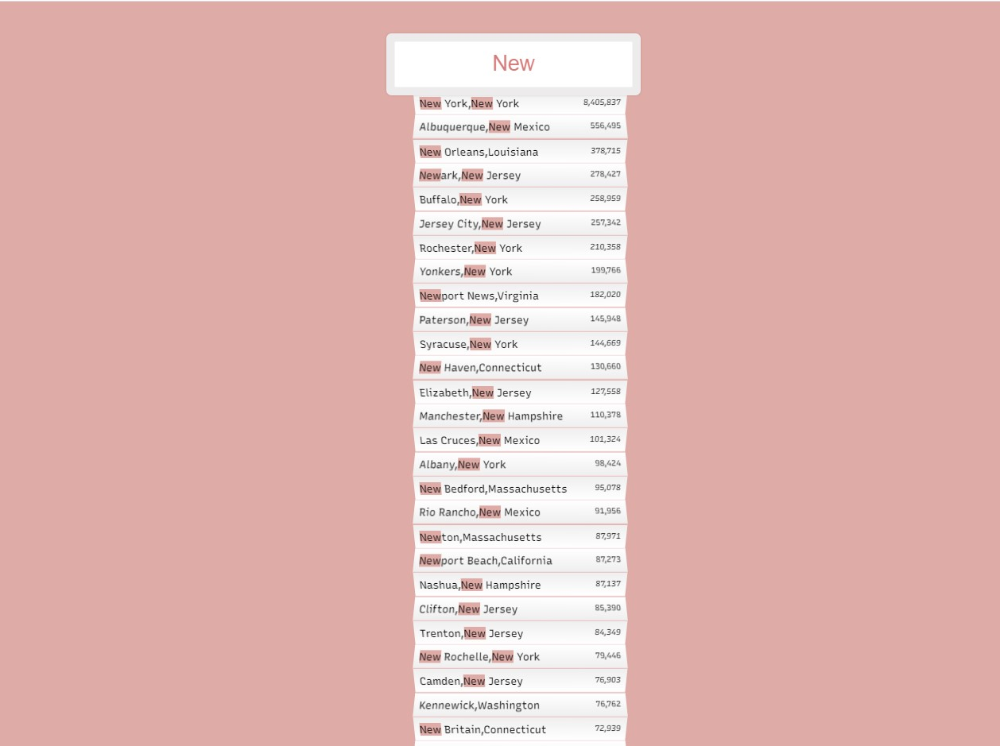

# <h1 align="center"> 👋Welcome to the City Search🎵 👋 </h1>
Welcome to mini google.😋 Just kidding. Here you can search US city or state and the corresponding matching keywords will be showed and highlighted.

## Live URL
Wanna try it out, I got you covered 😎

Here's the live URL: http://type-suggestion.surge.sh/

## Looks
## How To
This is how the app looks like-

## Tech I Used
This app is purely made with vanilla JavaScript & raw HTML/CSS. It is to demonstrate, if you can be creative you can make something amazing out of those core technologies.

Key topics-
+ **HTML:** I used HTML form and ul to show the results
+ **CSS:** I used quite a lot CSS properties here. Most of them are trivial but combining them in good order gave a nice look. I learned how to target odd and even child of an element, here, list element
+ **JS:** I used DOM manipulation technique to co-ordinate classes. Events that I used is mainly input

## Disclaimer
+ This is a challenge solution for Wes Bos 30 days JavaScript course. Awesome Course! Couldn't recommend it more. https://javascript30.com/
